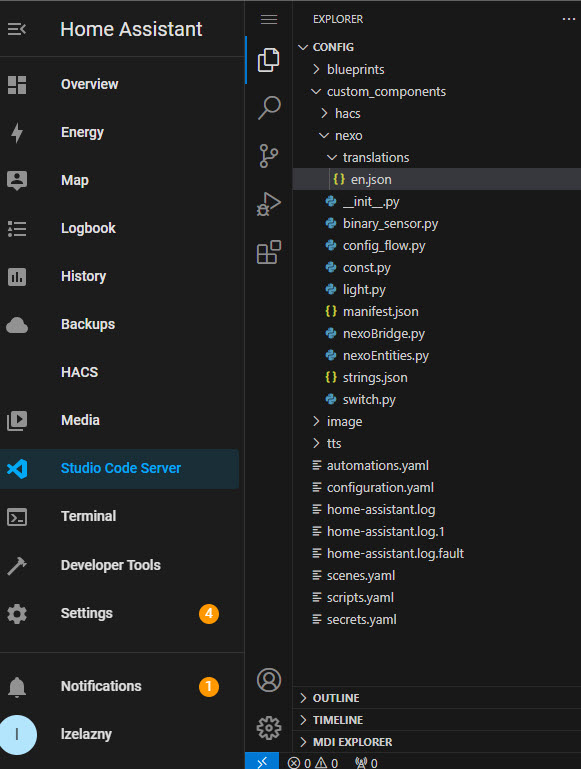
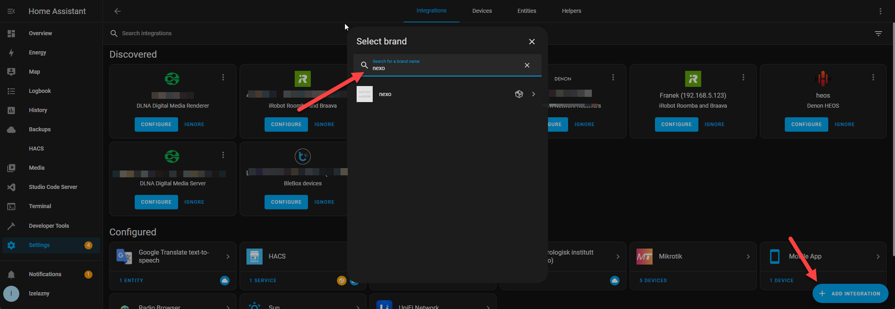
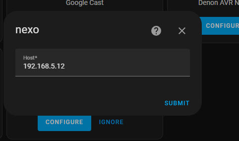
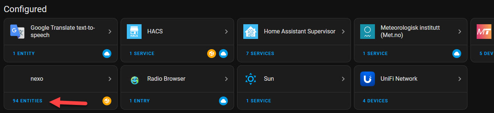

# hacs_nexo – Unofficial Home Assistant Integration for Nexwell/Nexo System

**Simple, unofficial integration for exposing devices managed by the Nexwell/Nexo system via the Multimedia Card.**

## Supported Features

This integration currently supports:

- **Lights** – On/Off  
- **Switches** – On/Off  
- **Binary Sensors** – On/Off  
- **Analog Sensors**
- **Blinds** – Open / Close / Stop / Set Position
- **Temperature**
- **Thermostats**  
- **Gates**  
- **Alarm Partitions**

## Installation

To install the integration:

1. **Copy the `nexo` folder** into your Home Assistant `custom_components` directory.

   

2. **Restart Home Assistant.**
3. Go to **Settings → Add Integration → nexo**.

   

4. **Enter the IP address** of your Nexwell Multimedia Card.

   
   
5. **You're all set! Enjoy your integration.**

   

    
## License

This project is licensed under the [Apache 2.0 License](https://github.com/lzelazny/hacs_nexo/blob/main/LICENSE).

