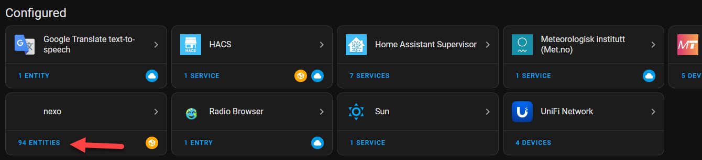

[](https://github.com/lzelazny/hacs_nexo/blob/main/README.md)
[](https://github.com/lzelazny/hacs_nexo/blob/main/README.pl.md)

# hacs_nexo – Nieoficjalna integracja Nexwell/Nexo dla Home Assistant

**Nieoficjalna integracja umożliwiająca udostępnienie urządzeń zarządzanych przez system Nexwell/Nexo za pośrednictwem Karty Multimedialnej.**

## Obsługiwane zasoby:

- **Oświetlenie** – Włącz / Wyłącz  
- **Przełączniki** – Włącz / Wyłącz  
- **Czujniki binarne** – Włącz / Wyłącz  
- **Czujniki analogowe**  
- **Rolety** – Otwórz / Zamknij / Zatrzymaj / Ustaw pozycję  
- **Temperatura**  
- **Termostaty**  
- **Bramy**  
- **Strefy alarmowe**  
- **Ściemniacze** - Włącz / Wyłącz / Ustaw jasność
- **LED** - Włącz / Wyłącz / Ustaw jasność
- **Grupy Ściemniaczy, LEDów** - Włącz / Wyłącz / Ustaw jasność
- **Grupy Przełączników** - Włącz / Wyłącz
- **Grupy Rolet** – Otwórz / Zamknij / Zatrzymaj / Ustaw pozycję
- **Stacja pogodowa** - Temperatura, Wiatr, Piktogram pogody, Kierunek wiatru, Kierunek światła, Prognoza z Open-Meteo
- **Komendy zewnętrzne**

## Instalacja

Aby zainstalować integrację:

1. **Skopiuj folder `nexo`** do katalogu `custom_components` w Home Assistant.

   

2. **Zrestartuj Home Assistant.**  
3. Przejdź do **Ustawienia → Dodaj integrację → nexo**.

   

4. **Wprowadź adres IP** Karty Multimedialnej Nexwell.

   

5. **Gotowe! Ciesz się integracją.**

   
   
## Komendy zewnętrze - jak używać

Jeżeli w Nexo używasz automatyki wyzwalanej komendami to możesz użyć tych komend w HA na trzy sposoby (przykładowa komenda "brama"):

1. Serwis

   **Narzędzia deweloperskie → Akcje:** > akcja: **nexo.send_ext_command** > cmd **brama**

2. Encje Button

   **Dodaj do pulpitu** > wg. encji > encja **brama** > **Kontynuuj
   
   **Dodaj do pulpitu** > wg. karty > **Przycisk** > encja **brama** > Interakcje > Wykonaj akcję > akcja: **nexo.send_ext_command** > cmd **brama** > **Zapisz**

   Po kliknięciu wysyła {"type":"ext_command","cmd":"brama"}.

   Aby pokazała się ancja z komendą lista komend musi byc ręcznie wpisana w configuration.yaml na poziomie root (tak jak automation: itd.): #niestety nie udaje mi się ich pobrać automatycznie - TO DO

```
nexo:
  ext_commands:
    - brama
    - drzwi
    - dowolna_komenda
```

3. Automatyzacja w YAML

```
alias: Otwórz bramę o 7:00
trigger:
  - platform: time
    at: "07:00:00"
action:
  - service: nexo.send_ext_command
    data:
      cmd: brama
```

## Licencja

Projekt jest objęty licencją [Apache 2.0 License](https://github.com/lzelazny/hacs_nexo/blob/main/LICENSE).
