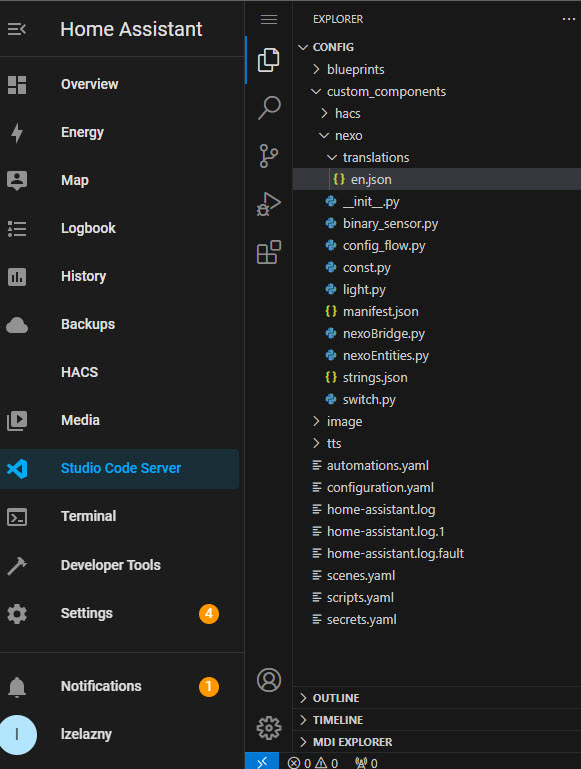

# hacs_nexo – Nieoficjalna integracja Nexwell/Nexo dla Home Assistant

**Nieoficjalna integracja umożliwiająca udostępnienie urządzeń zarządzanych przez system Nexwell/Nexo za pośrednictwem Karty Multimedialnej.**

## Obsługiwane zasoby:

- **Oświetlenie** – Włącz / Wyłącz  
- **Przełączniki** – Włącz / Wyłącz  
- **Czujniki binarne** – Włącz / Wyłącz  
- **Czujniki analogowe**  
- **Rolety** – Otwórz / Zamknij / Zatrzymaj / Ustaw pozycję  
- **Temperatura**  
- **Termostaty**  
- **Bramy**  
- **Strefy alarmowe**  
- **Ściemniacze** - Włącz / Wyłącz / Ustaw jasność
- **LED**  - Włącz / Wyłącz / Ustaw jasność
- **Grupy Ściemniaczy, LEDów**  - Włącz / Wyłącz / Ustaw jasność
- **Grupy Przełączników**  - Włącz / Wyłącz
- **Stacja pogodowa** - Temperatura, Wiatr, Piktogram pogody, Kierunek wiatru, Kierunek światła, Prognoza z Open-Meteo

## TO DO:
- **Grupy Rolet** – Otwórz / Zamknij / Zatrzymaj / Ustaw pozycję 

## Instalacja

Aby zainstalować integrację:

1. **Skopiuj folder `nexo`** do katalogu `custom_components` w Home Assistant.

   

2. **Zrestartuj Home Assistant.**  
3. Przejdź do **Ustawienia → Dodaj integrację → nexo**.

   

4. **Wprowadź adres IP** Karty Multimedialnej Nexwell.

   

5. **Gotowe! Ciesz się integracją.**

   

## Licencja

Projekt jest objęty licencją [Apache 2.0 License](https://github.com/lzelazny/hacs_nexo/blob/main/LICENSE).
